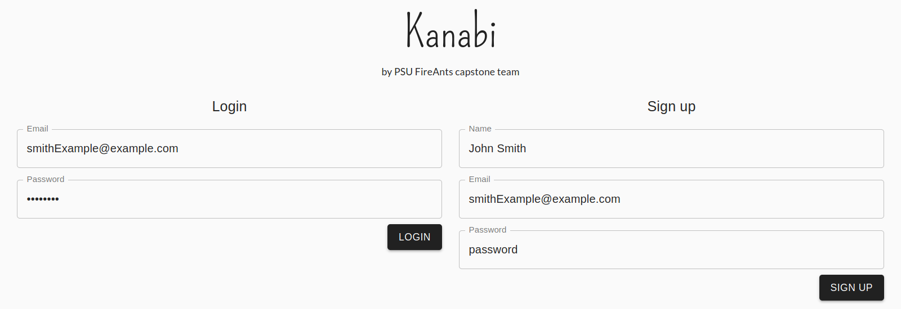
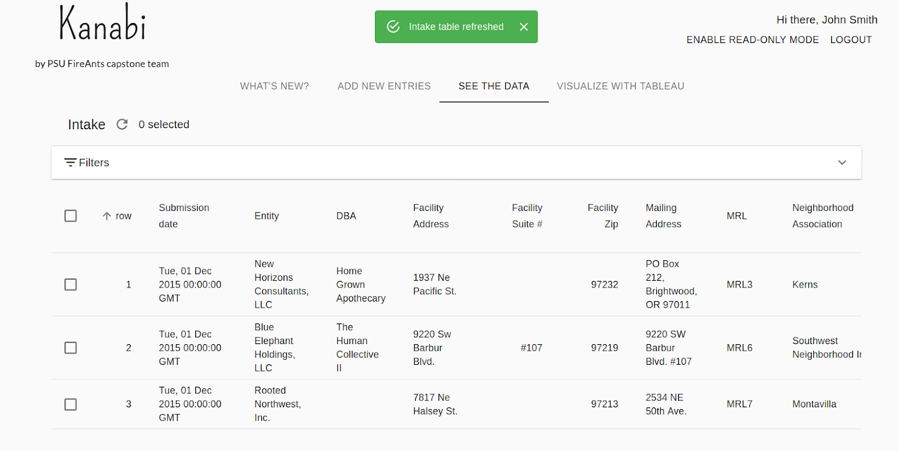
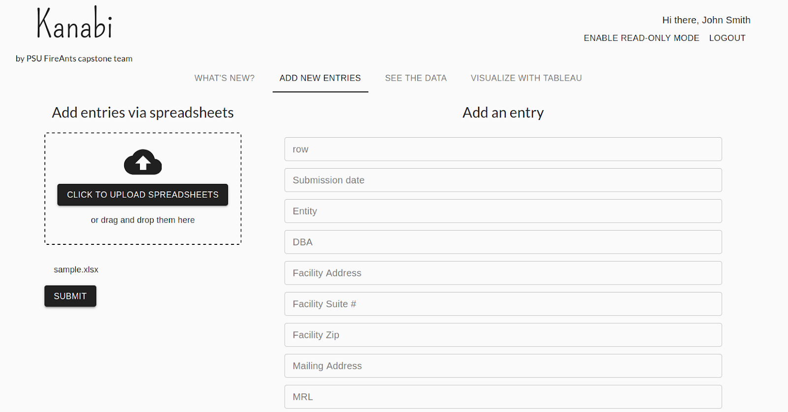

# Kanabi GUI

GUI for the Kanabi capstone project. Created using React JS and Material UI.

Packages:
- [Material UI](https://material-ui.com/)
- [gh-pages](https://github.com/gitname/react-gh-pages)
- [react-final-form](https://final-form.org/react)
- [react-dropzone](https://react-dropzone.js.org/)

## Deployments

`master` branch deployed automatically with heroku: https://kanabi-gui.herokuapp.com/

`gh-pages` branch deployed manually with GitHub pages: https://fireants-psu-capstone-team.github.io/cannabis-db-ui

## Screenshots

### Sign up/log in

### Database portal

### Add new entries

## Commands

### `npm start`

Runs the app in the development mode.

Open [http://localhost:3000](http://localhost:3000) to view it in the browser.

Page will reload automatically when you save your code edits.

### `npm run build`

Builds the app for production to the `build` folder.

### `npm run deploy`

(Must be an admin of this repository) Builds the app for production and deploy to GitHub pages.
